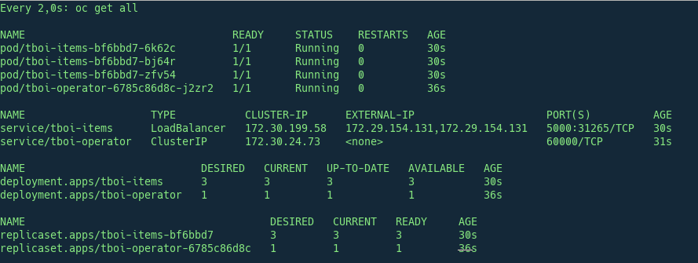
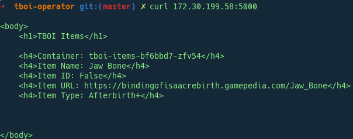

# TBOI Operator
The Binding of Isaac operator has one and great purpose to me, just learn how the operator works and how to implement my own one :).

## How to start

First, install the OC client with version 3.10 at least and raise up a cluster with:

```
oc cluster up
```

If you already have a cluster running just login in and start installing the [Operator-SDK](https://github.com/operator-framework/operator-sdk)
```
go get github.com/operator-framework/operator-sdk
cd $GOPATH/src/github.com/operator-framework/operator-sdk
git checkout master
make dep
make install
```

If you don't have the $GOBIN folder on path, I recommend to add it. For a temporal solution you could use this:
```
export GOPATH=$HOME/go
export GOBIN=$GOPATH/bin
export PATH=$PATH:$GOBIN
```

Now we must have the __operator-sdk__ command on the path, just execute the following command to verify it:
```
operator-sdk --version
```

Ok, let's clarify a couple of thing that maybe could make you crazy:

- Custom Resource[CR]: The resource that you will create on the k8s API.
- Custom Resource Definition[CRD]: The spec file for the future CR's that you will create. The SDK will create a Dummy one when you perform a build action, but it will not fit your CRD. I give you more info on [Helpers](#helpers) section
- The application image that you are handling with the operator is not the same image than the operator itself. Let's keep it separated to avoid problems
- Use a Makefile, it is simple and useful for many situations


## Testing TBOI Operator

To deploy the operator on the system, just follow this instuctions:
```
oc login -u system:admin
cd /tmp
git clone https://github.com/jparrill/tboi-operator/ && cd tboi-operator
make deploy
```

This will be the result:
```
➜  tboi-operator git:(master) make deploy
oc new-project tboi-operator
Now using project "tboi-operator" on server "https://127.0.0.1:8443".

You can add applications to this project with the 'new-app' command. For example, try:

    oc new-app centos/ruby-22-centos7~https://github.com/openshift/ruby-ex.git

    to build a new example application in Ruby.
    oc create -f deploy/rbac.yaml
    role.rbac.authorization.k8s.io "tboi-operator" created
    rolebinding.rbac.authorization.k8s.io "default-account-tboi-operator" created
    oc create -f deploy/crd.yaml
    customresourcedefinition.apiextensions.k8s.io "items.tboi.example.com" created
    oc create -f deploy/operator.yaml
    deployment.apps "tboi-operator" created
    oc create -f deploy/cr.yaml
    item.tboi.example.com "tboi-items" created
    oc get all
    NAME                                 READY     STATUS              RESTARTS   AGE
    pod/tboi-operator-6785c86d8c-j2zr2   0/1       ContainerCreating   0          0s

    NAME                            DESIRED   CURRENT   UP-TO-DATE   AVAILABLE   AGE
    deployment.apps/tboi-operator   1         1         1            0           0s

    NAME                                       DESIRED   CURRENT   READY     AGE
    replicaset.apps/tboi-operator-6785c86d8c   1         1         0         0s

```

And here you have some Screenshots about the status:






## Helpers

- Using Makefile for development:
	- __make gen__ (Use it after modify your types.go):
	```
	operator-sdk generate k8s
	```
	
	- __make build__ (Use it after modify your handler.go, you need to set those variables on the Makefile):
	```
	operator-sdk build docker.io/${USER}/${OP_NAME}:${DOCK_TAG}
    docker push docker.io/${USER}/${OP_NAME}:${DOCK_TAG}
	```

	- __make deploy__ (Use it to test your operator):
	```
    oc new-project ${OP_NAME}
   	oc create -f deploy/rbac.yaml
   	oc create -f deploy/crd.yaml
   	oc create -f deploy/operator.yaml
    oc create -f deploy/cr.yaml
	```

	- __make clean__ (Use it to clean the environment, it takes some seconds, ensure the action with a ```oc projects``` until continue with another deployment)
	```
	 oc delete -f deploy/cr.yaml
     oc delete -f deploy/operator.yaml
     oc delete -f deploy/rbac.yaml
     oc delete -f deploy/crd.yaml
     oc delete project ${OP_NAME}
     oc project default
	```

- This is how looks like the types.go vs CRD vs CR:
    - types.go
    ```go
    ...
    ...
    ...
    type ItemSpec struct {
    	ItemName string `json:"itemName"`
    	ItemUrl  string `json:"itemUrl"`
    	ItemSize int32  `json:"itemSize"`
    }
    
    type ItemStatus struct {
    	ApiPods []string `"json:apiPods"`
    }
    ```
    
    - crd.yaml
    ```yaml
    apiVersion: apiextensions.k8s.io/v1beta1
    kind: CustomResourceDefinition
    metadata:
      name: items.tboi.example.com
    spec:
      group: tboi.example.com
      names:
        kind: Item
        listKind: ItemList
        plural: items
        singular: item
      scope: Namespaced
      version: v1alpha1
    ```
    
    - cr.yaml
    ```yaml
    apiVersion: "tboi.example.com/v1alpha1"
    kind: "Item"
    metadata:
        name: "tboi-items"
    spec:
        ItemName: "Godhead"
        ItemUrl: "https://bindingofisaacrebirth.gamepedia.com/Godhead"
        ItemSize: 3
    ```

- Here you could find info about the helpers/bindings to declare objects on the handler.go
    - https://godoc.org/k8s.io/api
    - https://godoc.org/k8s.io/api/core/v1
    - https://godoc.org/k8s.io/api/apps/v1

- Here you could find some awesome examples of Operators
    - https://github.com/coreos/etcd-operator
    - https://github.com/operator-framework/operator-sdk/tree/master/example/memcached-operator
    - https://github.com/spotahome/kooper/tree/master/examples

- Some Tutorials and How-to
    - https://github.com/mvazquezc/ostack-meetup-operator
    - https://github.com/operator-framework/getting-started
	- https://github.com/operator-framework/operator-sdk/blob/master/doc/user-guide.md


## References

- [Getting Started](https://github.com/operator-framework/getting-started)
- [Operators SDK User Guide](https://github.com/operator-framework/operator-sdk/blob/master/doc/user-guide.md)
- [OPS SDK Main repo](https://github.com/operator-framework/operator-sdk)
- [Python Memcached Operator](https://github.com/kbst/memcached/blob/master/manifests/memcached.json)
- [Awesome Operators](https://github.com/operator-framework/awesome-operators)
- [K8s Operator SDK Guide](https://banzaicloud.com/blog/operator-sdk/)

## References Custom Controllers

- https://engineering.bitnami.com/articles/a-deep-dive-into-kubernetes-controllers.html
- https://engineering.bitnami.com/articles/kubewatch-an-example-of-kubernetes-custom-controller.html
- https://itnext.io/under-the-hood-of-the-operator-sdk-eebc8fdeebbf
- https://github.com/operator-framework/awesome-operators
- https://resources.coreos.com/youtube-coreos-fest-2017/writing-a-custom-controller-extending-the-functionality-of-your-cluster
- https://admiralty.io/kubernetes-custom-resource-controller-and-operator-development-tools.html
